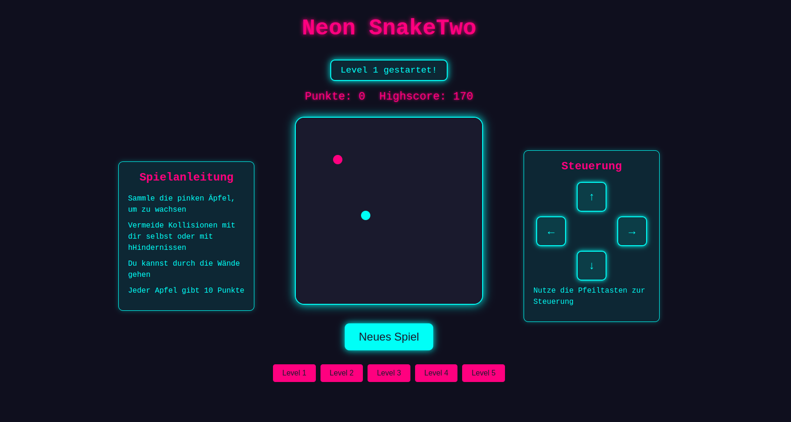

# NeonSnakeTwoGame

## Beschreibung

### Neon SnakeTwo ist mein erstes Spielprojekt, inspiriert vom klassischen Snake-Spiel, mit modernen Neon-Design-Elementen und neuen Herausforderungen wie Leveln und Hindernissen. Dieses Projekt wurde erstellt, um meine Fähigkeiten in Webentwicklung und Programmierung zu verbessern.

## Das Spiel bietet:

-   5 Level, jedes mit unterschiedlichen Hindernissen und Geschwindigkeiten.
-   Zufällige Hindernisse, die bei bestimmten Leveln erscheinen.
-   Visuelle Steuerung, die sowohl mit der Tastatur als auch über Klicks funktioniert.
-   Highscore-System, das den höchsten Punktestand speichert.
-   GitHub Pages-Hosting, um das Spiel direkt online zu spielen.

## Technologien

Dieses Projekt wurde mit folgenden Technologien entwickelt:

-   HTML5: Strukturierung der Webseite und Einbindung von Canvas für das Spielfeld.
-   CSS3: Gestaltung des Spiels mit einem modernen Neon-Design.
-   JavaScript: Spielmechanik, Steuerung, Level-Logik und Rendering.
-   GitHub Pages: Hosting des Projekts für den einfachen Zugriff

## Spielanleitung

### Ziel des Spiels:

Sammle die pinken Äpfel, um Punkte zu sammeln und die Schlange wachsen zu lassen.
Vermeide Kollisionen mit Hindernissen und dir selbst.
Steuerung:

Pfeiltasten: Steuere die Richtung der Schlange (↑, ↓, ←, →).
Visuelle Steuerung: Klicke auf die Pfeile, um die Richtung zu ändern.
Level:

-   Level 1: Keine Hindernisse, normale Geschwindigkeit.
-   Level 2: Wenige Hindernisse, gleiche Geschwindigkeit.
-   Level 3: Mehr Hindernisse, etwas schneller.
-   Level 4: Wenige Hindernisse, höhere Geschwindigkeit.
-   Level 5: Viele Hindernisse, maximale Geschwindigkeit.

### Highscore: Dein höchster Punktestand wird gespeichert und angezeigt.

## [Link to the game](https://fabricemru.github.io/NeonSnakeTwoGame/)

